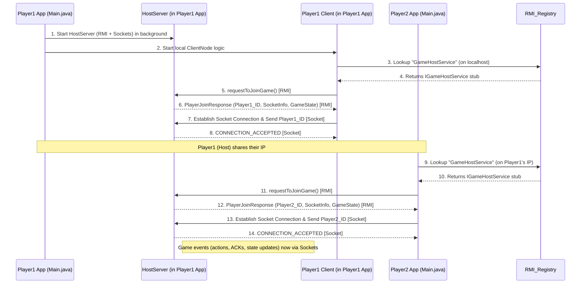

# Design Document: Multiplayer Shooter Game (Player as Host & RMI)

**Course:** Distributed Systems Security
**Date:** May 2025

## 1. Introduction

This document outlines the design for a multiplayer shooter game where the first player to start a session acts as the host. The system uses Java RMI for initial node interaction and client registration, followed by Java Sockets for real-time game event communication. Players interact on a 2D grid by shooting, healing, and moving. The host player's application manages the authoritative game state and logic, incorporating logical clocks and an adapted total order multicast for action processing via sockets.

## 2. System Architecture

The game implements a **Player-as-Host Model** using a hybrid communication strategy:

1. **Application Startup (`Main.java`)**:

* A single application entry point presents a menu: "Create Game" or "Join Game".
* **Create Game**: The player choosing this option becomes the Host. Their application instance:
  * Starts the `HostServer` logic (RMI service and socket listener) in a background thread.
  * Immediately starts a local `ClientNode` instance (for this host player), which connects to its own `HostServer` logic. This player is typically "Player1".
  * Displays the host's IP for other players to join.
* **Join Game**: The player choosing this option becomes a Client. Their application instance:
  * Prompts for the Host's IP address.
  * Initiates the RMI connection to the specified Host.

2. **Phase 1: RMI for Initialization and Discovery (Client Joining Host)**

* The Host's application runs an RMI service (`IGameHostService`).
* A joining `ClientNode` looks up this RMI service and calls `requestToJoinGame()`. This involves parameter passing (client information to host).
* The Host's RMI service assigns a unique `PlayerID` and returns it along with the Host's IP address and port number for *socket-based* game event communication, plus an initial `GameState`. This is parameter passing from host to client.

3. **Phase 2: Sockets for Real-time Game Events**

* After the RMI handshake, the joining `ClientNode` (and the host player's local `ClientNode`) uses the received IP and port to establish a direct socket connection to the Host's game event listener.
* The client sends its RMI-assigned `PlayerID` as the first message over the socket for identification.
* All subsequent game actions, event notifications, acknowledgments, and game state updates are exchanged over this socket connection using a custom `Message` protocol.
* **Host Player's Application:**

  * Runs both `HostServer` logic (RMI service, socket listener, game state management, TO-Multicast for socket actions) and a `ClientNode` instance for their own gameplay.
* **Joining Client Player's Application:**

  * Runs a `ClientNode` instance that connects to the Host player's `HostServer` logic.

**Conceptual Interaction Flow Diagram (Player1 as Host):**

